# v7.0 Phase 1: LangGraph 에이전트 아키텍처

## 🏗️ 아키텍처 개요

v7.0의 핵심은 선형 분류 함수에서 LangGraph를 사용한 **상태 기반 에이전트 워크플로우**로의 전환입니다.

### 현재 vs 신규

| 기능 | v6.0 (현재) | v7.0 (LangGraph 에이전트) |
|---|---|---|
| **로직** | 선형 (입력 → LLM → 출력) | **순환 그래프** (입력 → 노드 → 조건부 엣지 → 노드...) |
| **컨텍스트** | 무상태 (원샷) | **상태 기반** (대화/추론 이력 유지) |
| **에러 처리** | 단순 Try/Except | **자가 수정 루프** (피드백과 함께 재시도) |
| **출력** | 고정 스키마 (Pydantic) | **구조화된 출력** + 추론 추적 |

---

## 🧠 에이전트 워크플로우 (그래프)

```mermaid
graph TD
    Start([시작]) --> analyze_node
    analyze_node --> retrieve_node
    retrieve_node --> classify_node
    classify_node --> validate_node
    validate_node -- 신뢰도 > 70% --> End([종료])
    validate_node -- 신뢰도 < 70% --> reflect_node
    reflect_node --> classify_node
```



### 노드 설명

1.  **`analyze_node` (입력 분석)**:
    - 사용자 입력(파일 내용)에서 핵심 키워드와 의도를 추출합니다.
    - 예: "이 문서는 2025년 마케팅 예산안입니다." → Entity: `Marketing`, `Budget`, `2025`

2.  **`retrieve_node` (맥락 검색)**:
    - 추출된 키워드로 기존 유사 문서를 검색(벡터 검색)하거나 사용자 프로필(온보딩 데이터)을 참조합니다.
    - 예: "사용자는 'Marketing'을 'Projects' 카테고리에 주로 넣었다."

3.  **`classify_node` (분류 수행)**:
    - 입력 + 분석 내용 + 맥락 정보를 종합하여 LLM이 PARA 분류를 수행합니다.
    - 출력: Category, Confidence Score, Reasoning

4.  **`validate_node` (검증)**:
    - LLM의 출력 형식이 올바른지, 신뢰도가 임계값(Threshold) 이상인지 검사합니다.
    - **조건부 엣지**:
        - `통과`: 종료 노드로 이동
        - `실패`: `reflect_node`로 이동 (재시도)

5.  **`reflect_node` (회고 및 프롬프트 수정)**:
    - 왜 신뢰도가 낮은지, 또는 왜 형식이 틀렸는지 분석하여 프롬프트를 수정합니다.
    - 예: "이전 시도에서 'Resources'와 'Archives'를 혼동했습니다. 다시 한번 정의를 확인하세요."

---

## 💾 State 스키마 (데이터 구조)

LangGraph에서 노드 간에 전달되는 상태(State) 데이터 구조입니다.

```python
from typing import TypedDict, List, Optional

class AgentState(TypedDict):
    # 입력
    file_content: str
    file_name: str
    
    # 내부 처리
    extracted_keywords: List[str]  # 초기값: []
    retrieved_context: Optional[str] # 초기값: None
    retry_count: int               # 초기값: 0
    
    # 출력
    classification_result: Optional[dict] # 초기값: None
    confidence_score: float        # 초기값: 0.0
    reasoning: Optional[str]       # 초기값: None
```

---

## 🔌 통합 지점

### `backend/agent/graph.py` (신규)
에이전트 워크플로우의 핵심 그래프 정의 파일입니다.

```python
# 의사 코드
from typing import Literal
from langgraph.graph import StateGraph, END
from backend.agent.state import AgentState
from backend.agent.nodes import (
    analyze_node,
    retrieve_node,
    classify_node,
    validate_node,
    reflect_node,
    should_retry
)

def create_workflow():
    """LangGraph 워크플로우 생성"""
    workflow = StateGraph(AgentState)
    
    # 노드 추가
    workflow.add_node("analyze", analyze_node)
    workflow.add_node("retrieve", retrieve_node)
    workflow.add_node("classify", classify_node)
    workflow.add_node("validate", validate_node)
    workflow.add_node("reflect", reflect_node)
    
    # 진입점 설정
    workflow.set_entry_point("analyze")
    
    # 엣지 추가
    workflow.add_edge("analyze", "retrieve")
    workflow.add_edge("retrieve", "classify")
    workflow.add_edge("classify", "validate")
    workflow.add_conditional_edges(
        "validate",
<<<<<<< feature/v7-planning
        should_retry, # Returns: Literal["end", "retry"]
=======
        should_retry,
>>>>>>> develop
        {
            "end": END,
            "retry": "reflect"
        }
    )
    workflow.add_edge("reflect", "classify")
    
    return workflow.compile()
```

### `backend/services/classifier_service.py` (수정)
기존 서비스를 에이전트 래퍼로 변경합니다.

```python
from backend.agent.graph import create_workflow

class ClassifierService:
    def __init__(self):
        self.agent = create_workflow()
    
    async def classify(self, file_content: str, file_name: str) -> dict:
        """에이전트를 통한 분류 (기존 인터페이스 유지)"""
        result = await self.agent.ainvoke({
            "file_content": file_content,
            "file_name": file_name,
            "extracted_keywords": [],
            "retrieved_context": "",
            "retry_count": 0,
            "classification_result": None,
            "confidence_score": 0.0,
            "reasoning": ""
        })
        return result["classification_result"]
```
