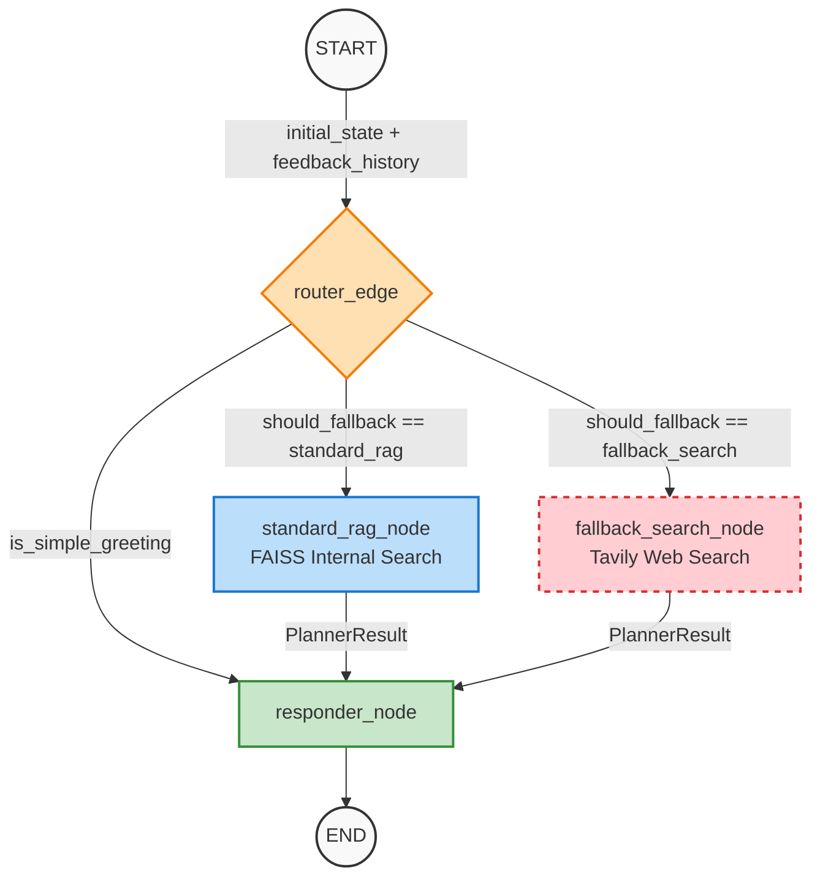

# LangGraph Fallback Routing Architecture (v8.0 Phase 5)

## Overview
This document outlines the conversational flow and intelligent fallback routing mechanism implemented in `backend/agent/chat/graph.py` and `backend/agent/chat/nodes.py`. 

To prevent repetitive LLM hallucinations and continuous negative feedback, the LangGraph orchestration utilizes a threshold-based fallback mechanism. If a user leaves a `thumbs down ("down")` rating twice within the last 3 turns, the RAG pipeline dynamically falls back to an external web search (Tavily).

## Architecture Diagram

## Route Definitions
- **responder**: For simple greetings, bypassing any search overhead.
- **standard_rag**: Standard routing path utilizing internal FAISS document embedding retrieval.
- **fallback_search**: Triggered upon unfulfilled queries tracking `negative_count >= FALLBACK_THRESHOLD` out of the temporal window. Employs Tavily API for Deep Web Research, isolating its context from RAG leftovers to avoid hallucination contamination.
