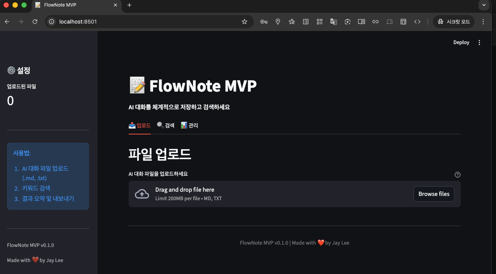
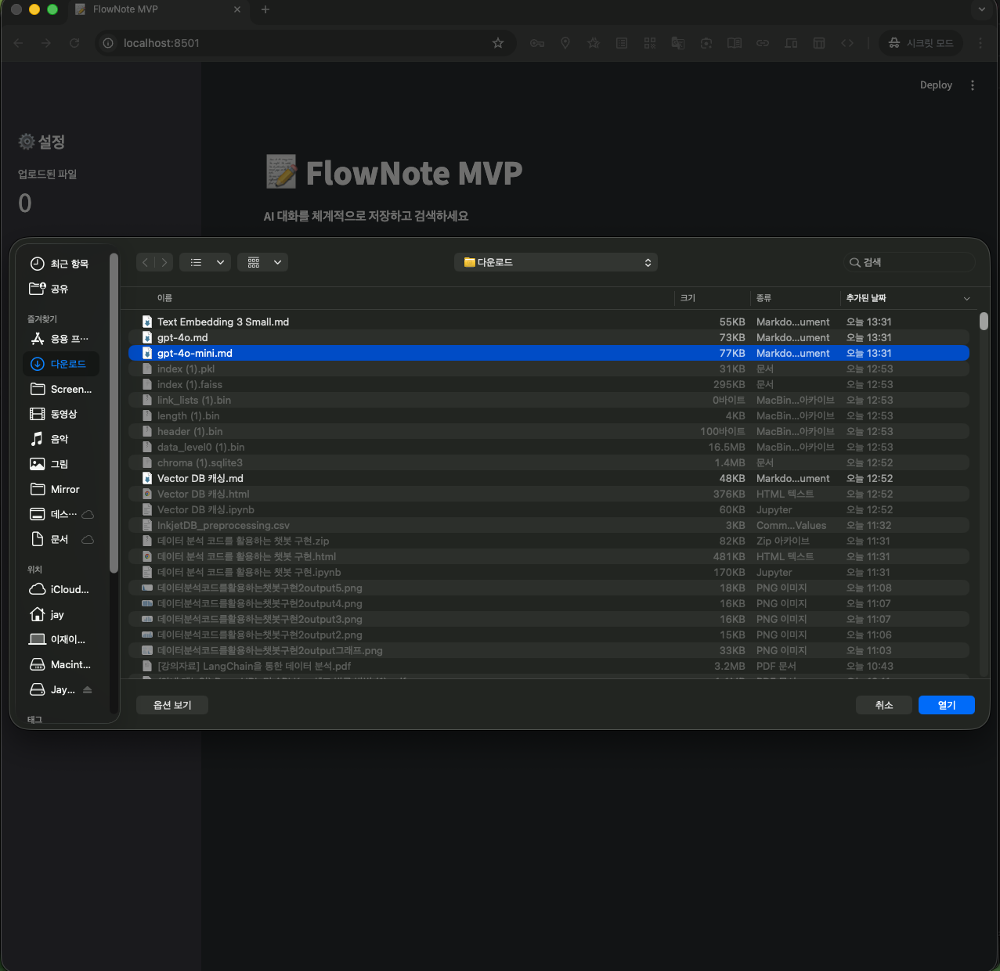
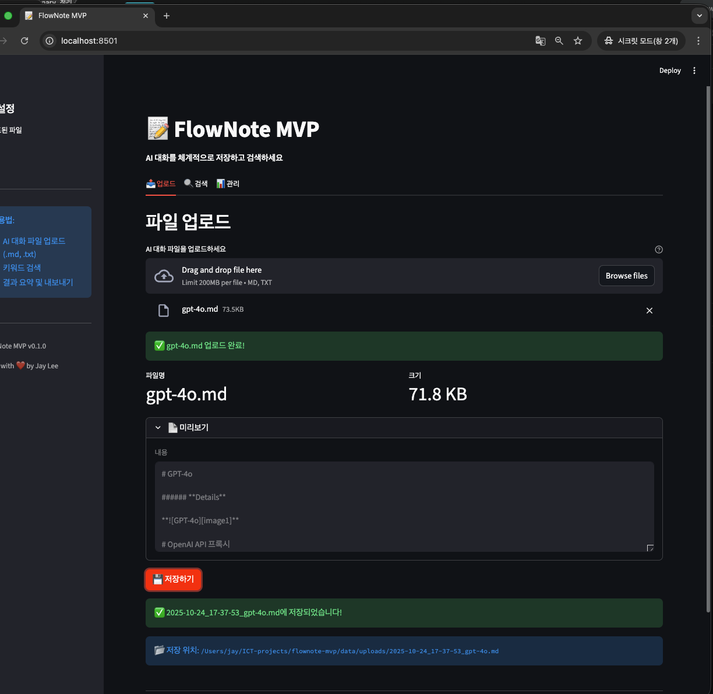
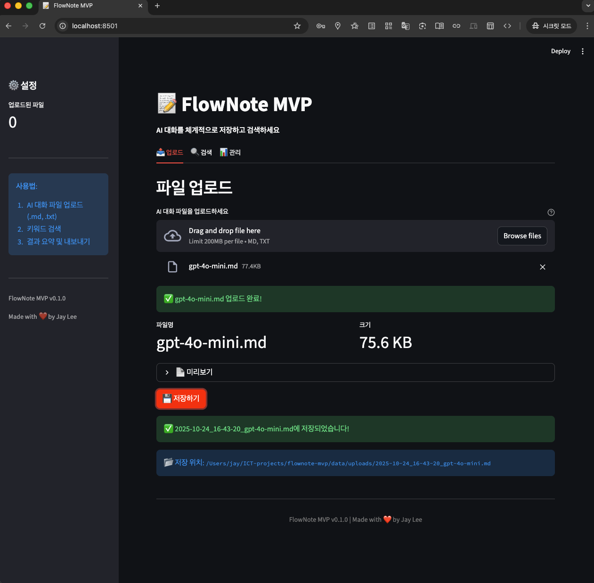
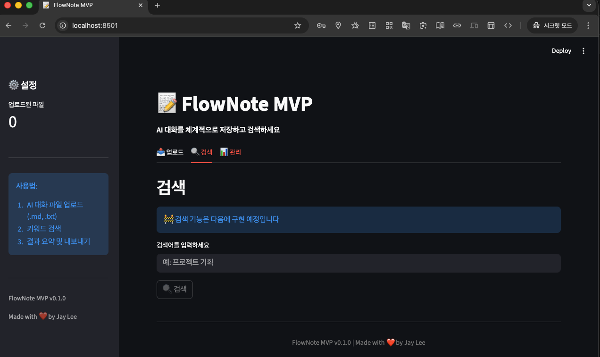
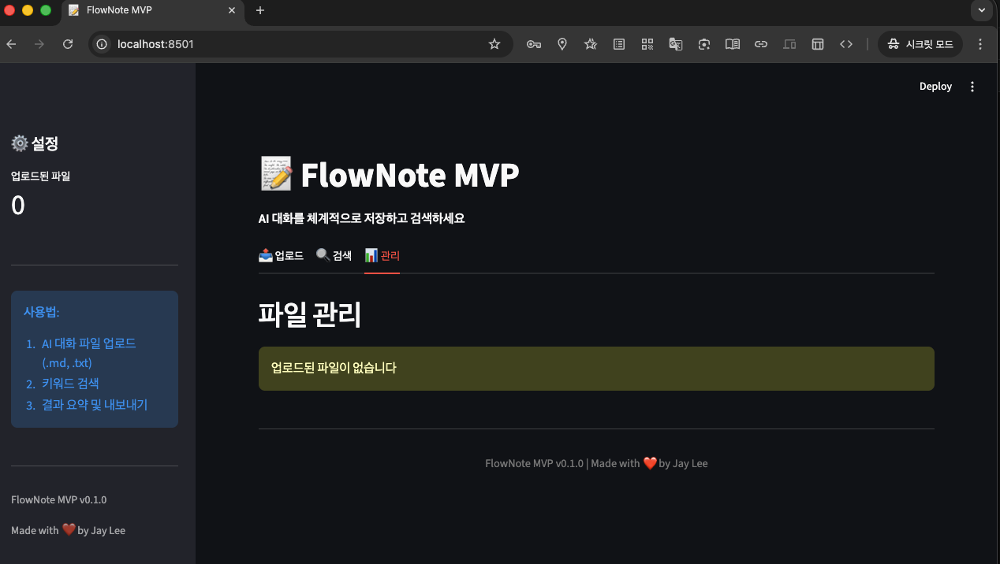
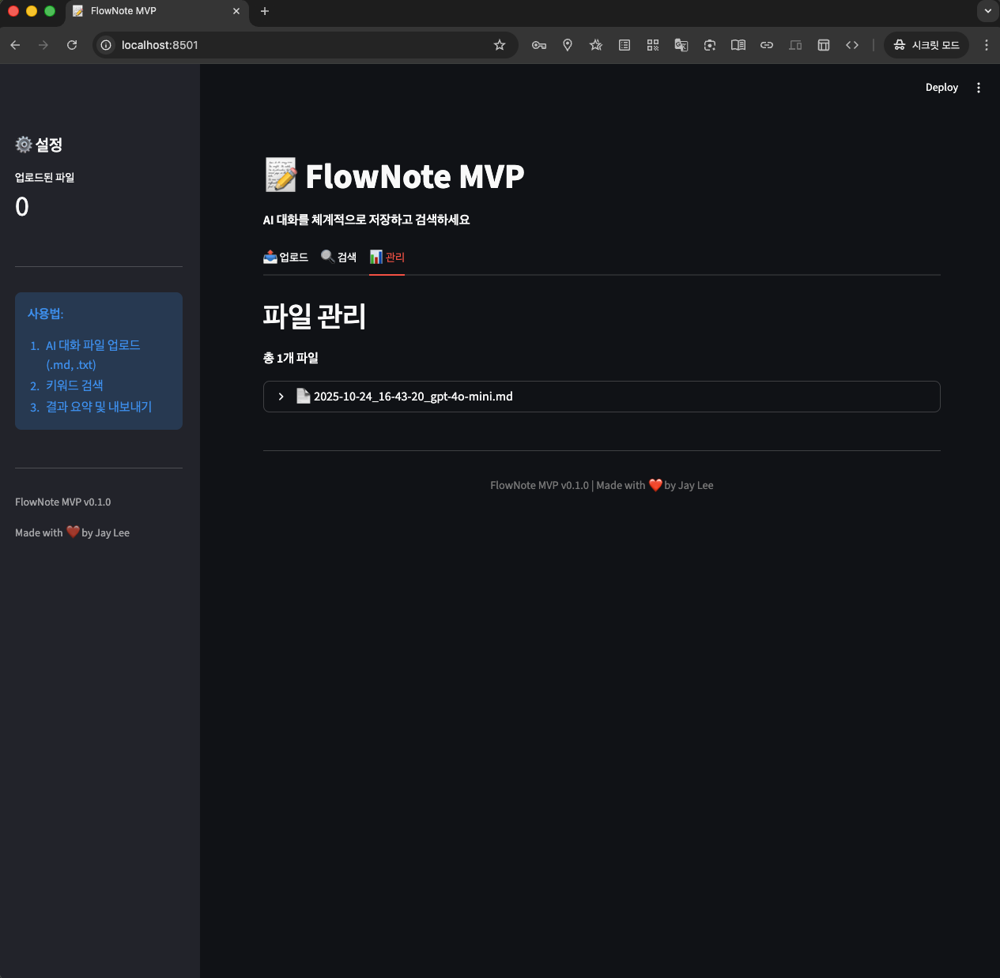
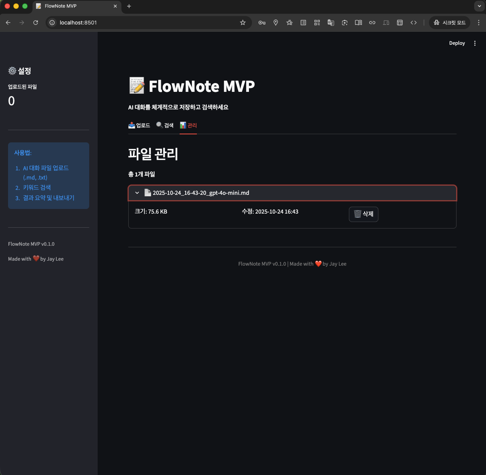
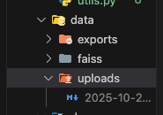
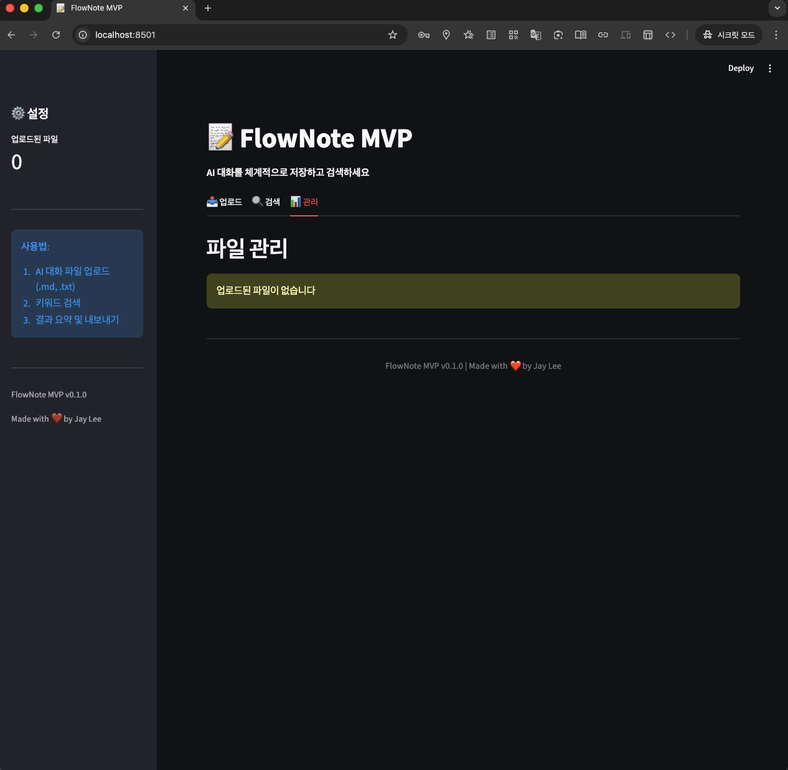

# 🧪 utils.py 실습 기록 — 2025-10-23

>> 📅 작성일: 2025-10-23

>> ✍️ 작성자: Jay (@jjaayy2222)

>> 📂 파일 경로: docs/practices/2025-10-23-utils-test.md


## 🎯 1. 목적
- `backend/utils.py` 내 유틸리티 함수들을 정리 및 리팩터링

- FlowNote의 파일 처리 및 텍스트 분할 기능의 기반을 검증하기 위함

- 각 함수는 추후 `backend/core/` 내 주요 기능(파일 업로드, 벡터화, 정리)에 재사용될 예정

<br>

## 🧰 2. 테스트 환경

  | 항목 | 내용 |
  |------|------|
  | Python | `3.11.10` (pyenv) |
  | 가상환경 | `myenv` |
  | 주요 패키지 | `pytest`, `langchain`, `python-dotenv` |
  | 경로 | `/flownote-mvp/backend/utils.py` |
  | 테스트 파일 | `/tests/test_utils.py` (로컬 임시 테스트 스크립트) |

<br>

## 🧩 3. 실습 내용

### ✅ 1) `get_timestamp()`
* **기능**: 현재 시각을 `YYYY-MM-DD_HH-MM-SS` 형식으로 반환

* **테스트 결과**: 정상적으로 포맷된 문자열 반환
  * *예: `2025-10-23_18-04-11`*

* **활용 예정**: 로그 파일명, Markdown 내보내기 시 타임스탬프 삽입 등

```python
    def get_timestamp():
        return datetime.now().strftime("%Y-%m-%d_%H-%M-%S")
```

<br>

### ✅ 2) `read_file()` & `save_file()`

* 기능:
  * UTF-8 인코딩으로 파일을 읽고 쓰는 기본 함수

* 테스트 결과:
  * 문자열 저장 → 정상적으로 동일 내용으로 읽힘
  * Path 객체를 이용해 OS 간 경로 이슈 없이 동작 확인

```python

    def read_file(file_path: Path) -> str:
        with open(file_path, "r", encoding="utf-8") as f:
            return f.read()

    def save_file(content: str, file_path: Path):
        file_path.parent.mkdir(parents=True, exist_ok=True)
        with open(file_path, "w", encoding="utf-8") as f:
            f.write(content)

    # 🧾 테스트 입력

    test_content = "FlowNote MVP test"
    save_file(test_content, Path("data/test_output.txt"))
    assert read_file(Path("data/test_output.txt")) == test_content

```

<br>

### ✅ 3) `chunk_text()`

* 기능:
  * 긴 텍스트를 일정한 길이로 분할
  * `chunk_size`와 `overlap` 조절 → 자연스러운 분할 가능

* 테스트 결과:
  * 500자 단위로 나누어지며, 100자씩 겹침 확인
  * 짧은 문장에서는 정상적으로 1개 청크만 반환

```python

    def chunk_text(text: str, chunk_size: int = 500, overlap: int = 100) -> List[str]:
        chunks = []
        start = 0
        while start < len(text):
            end = start + chunk_size
            chunk = text[start:end]
            chunks.append(chunk)
            start += (chunk_size - overlap)
        return chunks

```

<br>

### ✅ 4) `format_file_size()`

* 기능:
  * 파일 크기를 `B`, `KB`, `MB`, `GB`, `TB` 단위로 변환

* 테스트 결과:
  * `1536` → **`1.5 KB`** 출력 확인.
  * 실제 업로드 파일의 메타데이터 포맷팅에 유용

```python

def format_file_size(size_bytes: int) -> str:
    for unit in ['B', 'KB', 'MB', 'GB']:
        if size_bytes < 1024.0:
            return f"{size_bytes:.1f} {unit}"
        size_bytes /= 1024.0
    return f"{size_bytes:.1f} TB"

```

<br>

### ✅ 5) `validate_file_extension()`

* 기능:
  * `허용된 확장자`만 `업로드` 가능하도록 검사

* 테스트 결과:
  * `.md`, `.txt` = `True`
  * `.pdf` = `False` → 정확히 필터링됨.

```python

    def validate_file_extension(filename: str, allowed_extensions: List[str]) -> bool:
        file_path = Path(filename)
        return file_path.suffix.lower() in allowed_extensions

```

---

## 🧭 4. Review

### 1) 핵심 기능 작동 확인

* 함수별 주석을 명확히 하여 Docstring 중심으로 리팩터링 완료

* `chunk_text`와 `format_file_size`는 향후 FlowNote Core에서 재활용 예정

* `read_file` / `save_file`은 파일 저장 시 경로 자동 생성 기능이 안정적으로 작동함을 확인

### 2) `Streamlit` 실행 테스트

* `➀ 가상 환경 활성화`

```bash

    # 가상환경 활성화
    pyenv activate myenv

    # 실행
    streamlit run app.py

    # 브라우저 자동 열림!
    # http://localhost:8501

```

  * 

<br>

* `➁ 테스트 - 파일 업로드 탭`

  * **`✅ 파일 선택 (.md 또는 .txt)`**
  * 

  * **`✅ 미리보기 확인`**
  * 

  * **`✅ 저장하기 클릭`**
  * 

  * **`✅ 성공 메시지 & balloons`**
  * 

<br>

* *`파일 관리 - 현재 미구현`*
  * 

<br>

* `➂ 테스트 - 관리 탭` 

  * **`✅ 파일 목록 표시`**

  * 

  * 

  * **`✅ 파일 정보 확인`**
  * 

    * 파일 생성 확인
    *  

  * **`✅ 삭제 버튼 작동`**
  * 


<br>

## 📌 5. Summary

| 항목                   | 설명                                                                                         |
|-----------------------|-------------------------------------------------------------------------------------------|
| **`📂 파일 경로`**      | `/flownote-mvp/backend/utils.py`                                                           |
| 🧩 함수 구성            | `get_timestamp`, `read_file`, `save_file`, `chunk_text`, `format_file_size`, `validate_file_extension` |
| 🧠 기능 요약              | `파일 입출력`, `텍스트 청크 분할`, `파일 크기 변환`, `확장자 검증` 등 ***`핵심 헬퍼 모듈`***                                             |

