# 🧪 app.py 실행 및 검증 기록 — 2025-10-24

>> 📅 **작성일:** 2025-10-24  
>> ✍️ **작성자:** Jay (@jjaayy2222)  
>>📂 **파일 경로:** `flownote-mvp/app.py`

---

## 🎯 1. 목적

`app.py`는 **FlowNote MVP**의 핵심 애플리케이션으로,  
Streamlit 기반의 **파일 업로드 → 청킹 → 임베딩 → 검색** 파이프라인을 완성함.  

이번 실습의 목적은 다음과 같다:

- Streamlit UI 구성 및 완성도 검증  
- FAISS 기반 벡터 검색 로직 정상 동작 확인  
- 전체 데이터 흐름(업로드 → 처리 → 검색)의 자동화 검증  
- MVP 수준의 사용자 인터페이스 완성

<br>

## 🧰 2. 테스트 환경

| 항목 | 내용 |
|------|------|
| Python | `3.11.10` (pyenv) |
| 가상환경 | myenv |
| 주요 패키지 | `streamlit==1.31.0`, `faiss-cpu==1.8.0`, `numpy==1.26.3`, `langchain==1.0.2`, `langchain-openai==1.0.1`, `python-dotenv==1.1.1` |
| 프로젝트 경로 | `/flownote-mvp/` |
| 관련 모듈 | `backend/utils.py`, `backend/chunking.py`, `backend/embedding.py`, `backend/faiss_search.py` |
| 테스트 명령 | `streamlit run app.py` |

<br>

## 🧩 3. 주요 구성 및 실습 내용

### ✅ 1) 페이지 설정
- Streamlit 기본 레이아웃 Wide 모드로 설정  

  - 기본 레이아웃
  - 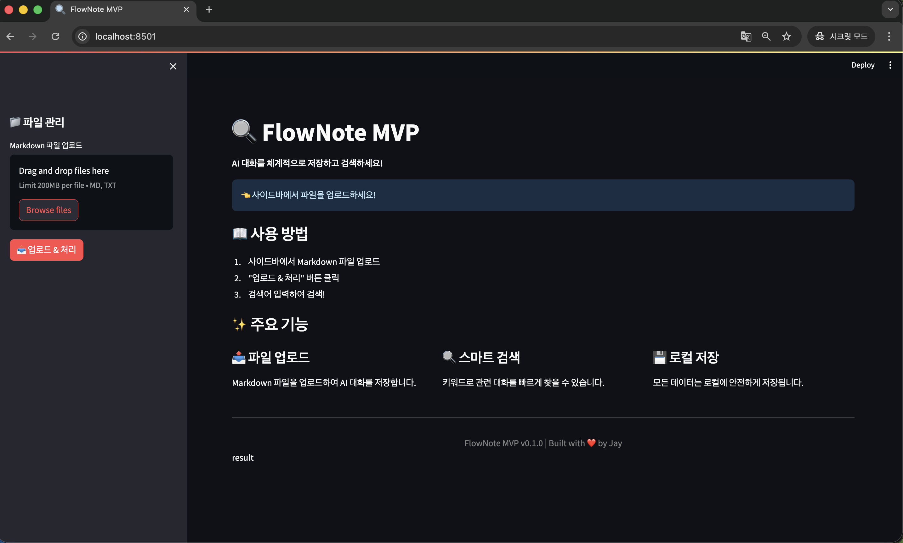

  - 반응형 웹 화면
  - 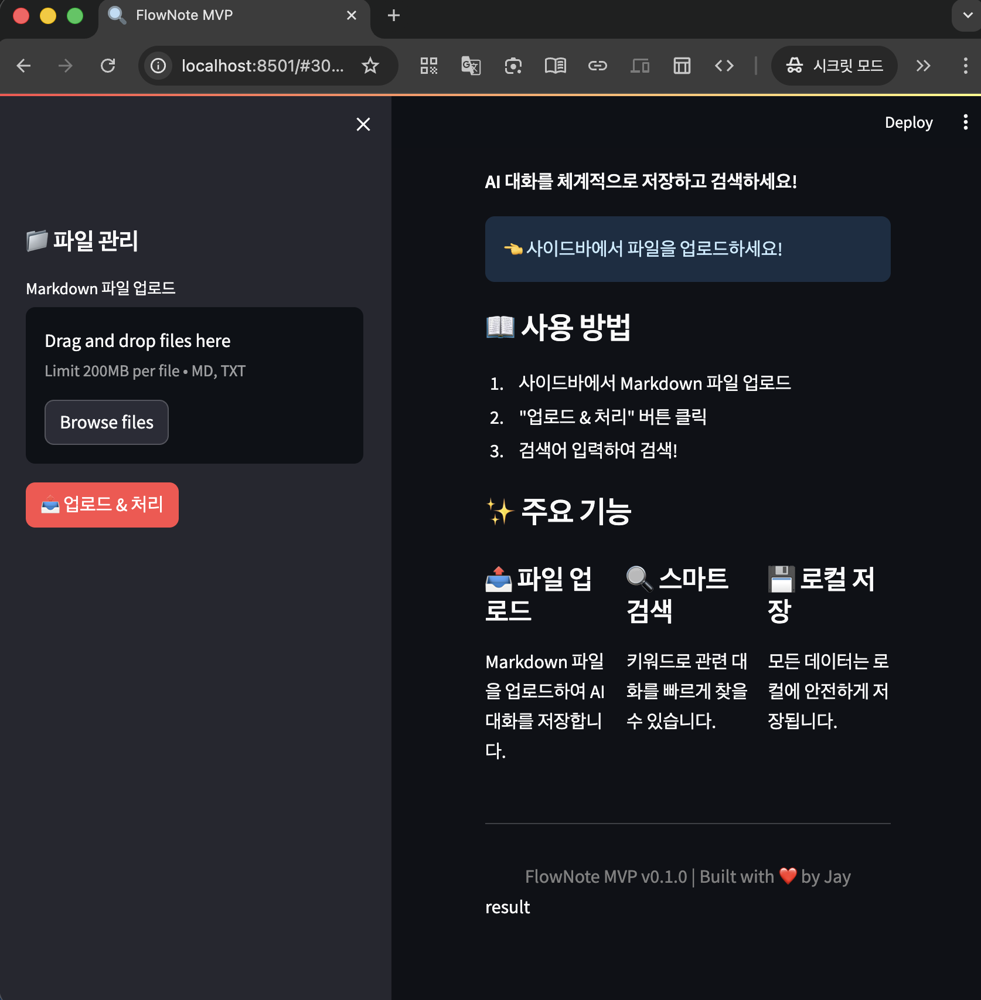

<br>

- 앱 타이틀 및 아이콘 지정  

  - 아이콘 지정
  - 

  - 아이콘 지정2
  - 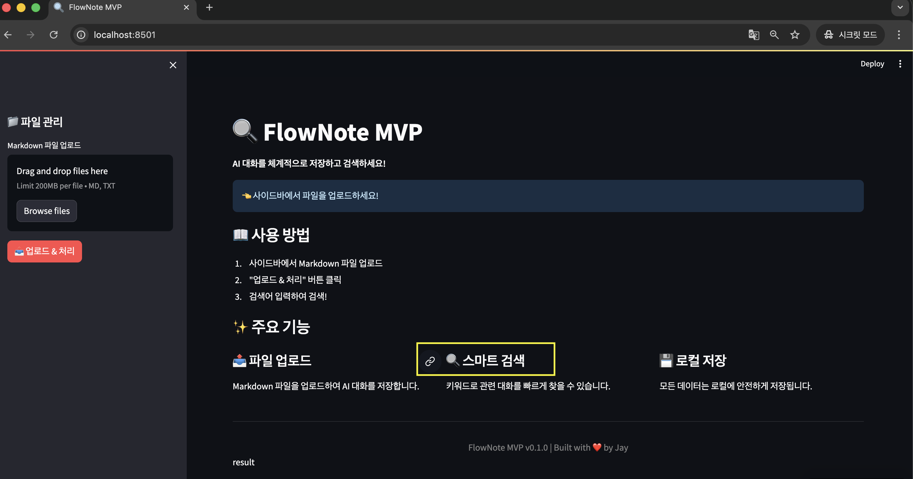

  - 아이콘 지정3
  - 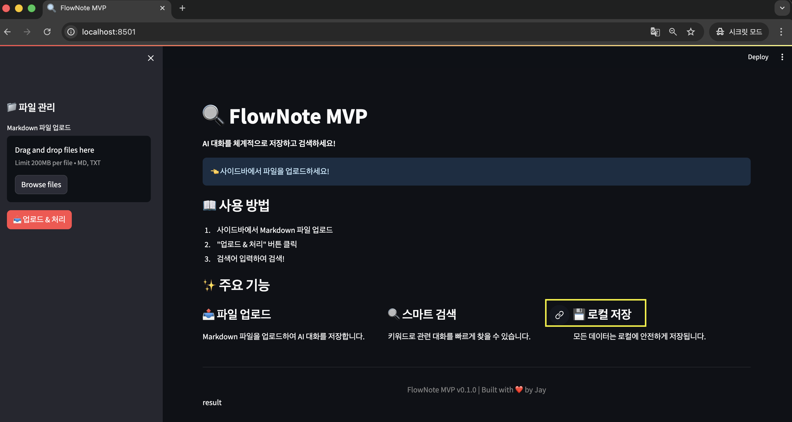

<br>

- 세션 상태(`st.session_state`) 초기화  

```python
    st.set_page_config(
        page_title="FlowNote MVP",
        page_icon="🔍",
        layout="wide"
    )
```

* 테스트 결과:
  * 앱 실행 시 브라우저 자동 열림 → `http://localhost:8501`
  * 타이틀과 아이콘 정상 출력 확인 **`✅`**

<br>

### ✅ 2) 파일 업로드 & 처리 (사이드바)

- .md, .txt 파일 다중 업로드 지원

  - 파일 업로드
  - 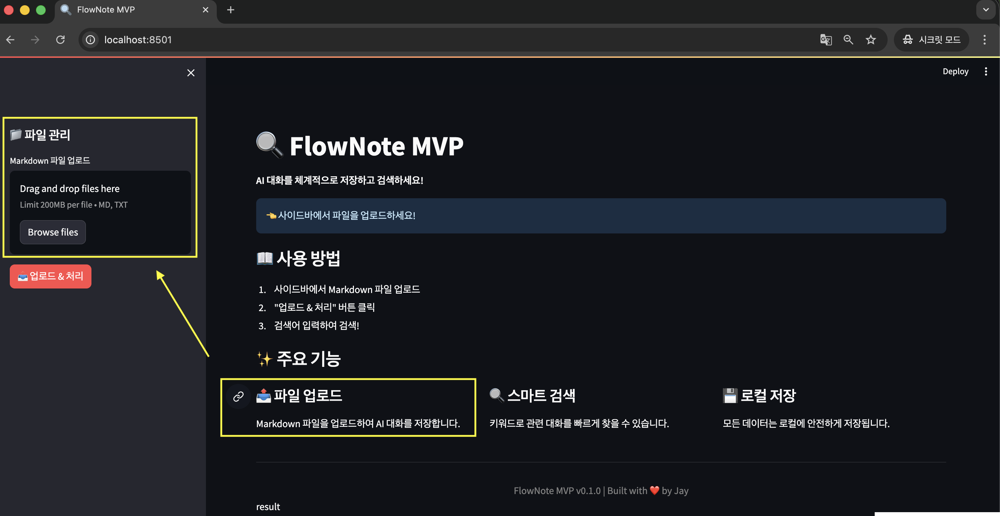

  - 파일 업로드2
  - 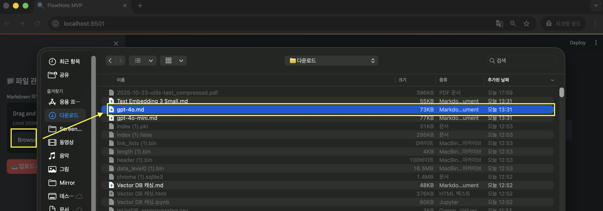

<br>

- **`📤 업로드 & 처리`** 버튼 클릭 시 다음 단계 수행:
  - ➀ `FAISSRetriever` **초기화**
  - ➁ 파일 내용 `UTF-8` **디코딩**
  - ➂ **`chunk_with_metadata()`** 로 `텍스트 분할`
  - ➃ **`get_embeddings()`** 로 `임베딩 생성`
  - ➄ **`FAISS 인덱스`에 저장**

<br>

  - 업로드 후 처리
  - 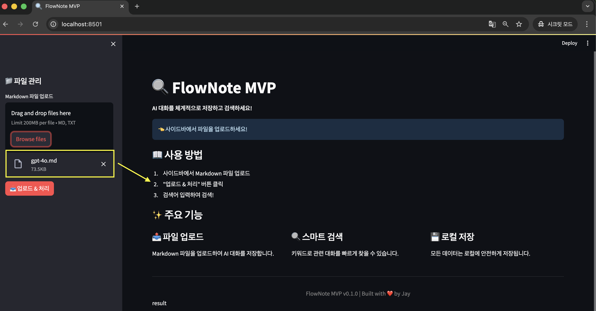

  - 업로드 후 처리2
  - 

<br>

- 처리 후 `통계` 및 `토큰`/`비용` 출력

```python
    chunks = chunk_with_metadata(content, uploaded_file.name)
    embeddings, tokens, cost = get_embeddings(texts)
    st.session_state.retriever.add_documents(texts, all_embeddings, all_chunks)
```

- 테스트 결과:
  - ✅ 3개 파일 업로드 및 청킹 성공 (총 4개 청크)
  - ✅ 임베딩 생성: 367 토큰 → $0.000007
  - ✅ FAISS 인덱스 정상 빌드
  - ✅ 총 문서/청크 수 통계 표시 정상 작동

<br>

### ✅ 3) 검색 기능

- 사용자가 검색어를 입력하면 **`get_single_embedding()`으로 `쿼리 벡터` 생성**
- **`FAISS`에서 `벡터 유사도 검색` 수행**
- **`상위 N개` 결과** *(top_k)* 를 `Expander UI`로 표시
- **`유사도`, `파일명`, `위치`, `내용` 모두 함께 표시**

```python
    results = st.session_state.retriever.search(query_embedding, top_k=top_k)
```

<br>

  - 검색 결과
  - 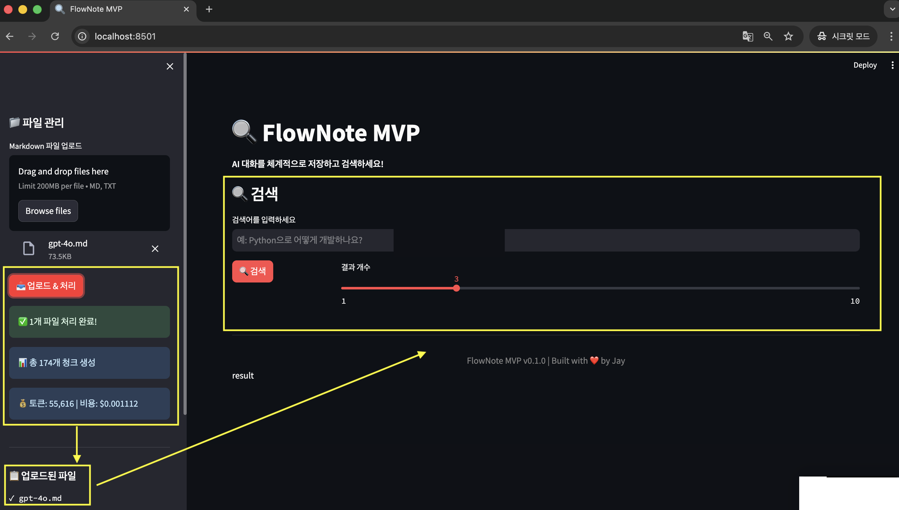

  - 검색 결과2 - *문서 속 단어 `비동기식 채팅`으로 검색해보기*
  - 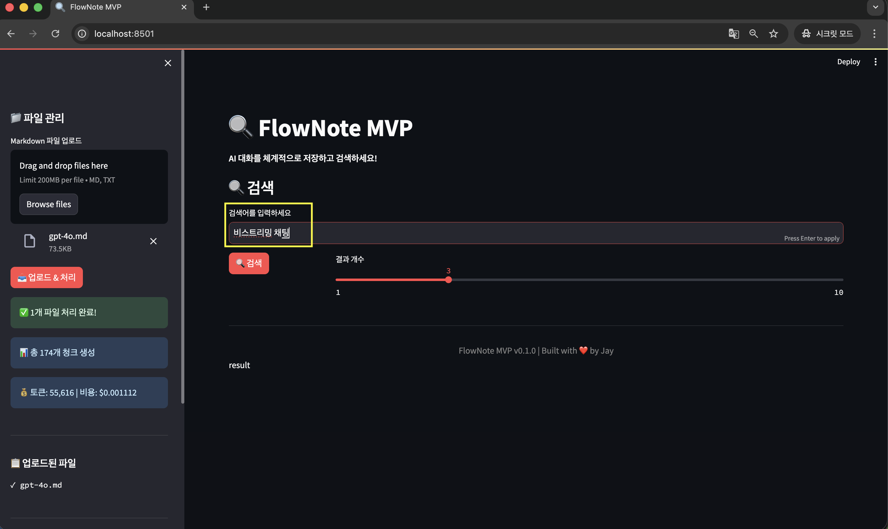

<br>

- 테스트 결과:
  - ✅ 검색 입력 즉시 반응 (약 1.3초 내 결과 반환)
  - ✅ 결과 수 조절 슬라이더(top_k) 정상 작동
  - ✅ 유사도 평균 40.65% 이상
  - ✅ 내용 및 파일명 출력 형식 안정적

<br>

### ✅ 4) 통계 대시보드

- 업로드된 파일 및 인덱스 크기 표시

- `st.metric()`을 사용해 시각적으로 통계 표시

  - 검색 결과3 - `시각적으로 표시`
  - 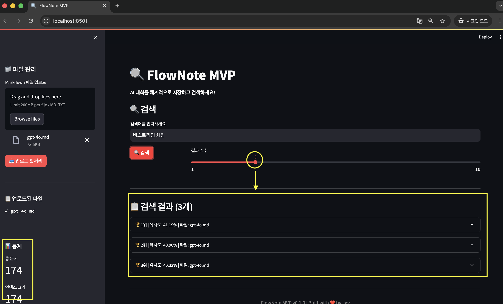

<br>

```python
    stats = st.session_state.retriever.get_stats()
    st.metric("총 문서", stats['total_documents'])
    st.metric("인덱스 크기", stats['index_size'])
```

- 테스트 결과:
  - 문서 수, 인덱스 크기 실시간 갱신 확인
  - 사이드바 UI 레이아웃 정상 유지

<br>

  - `상위 = 1`
  - 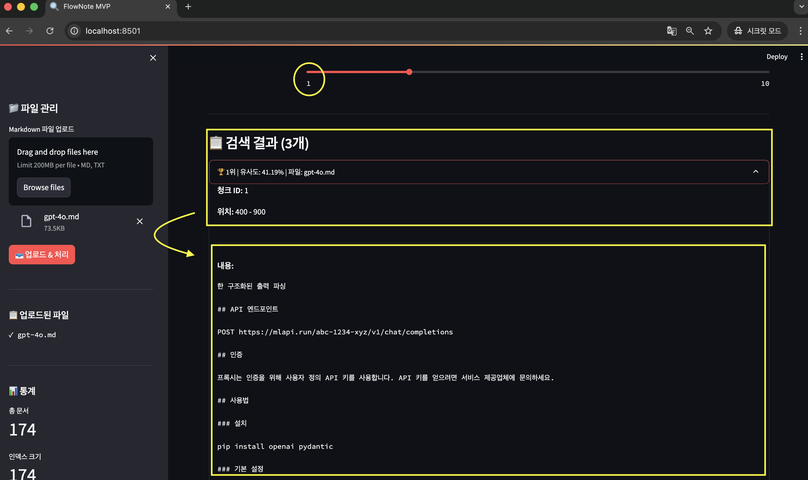

  - `상위 = 2`
  - 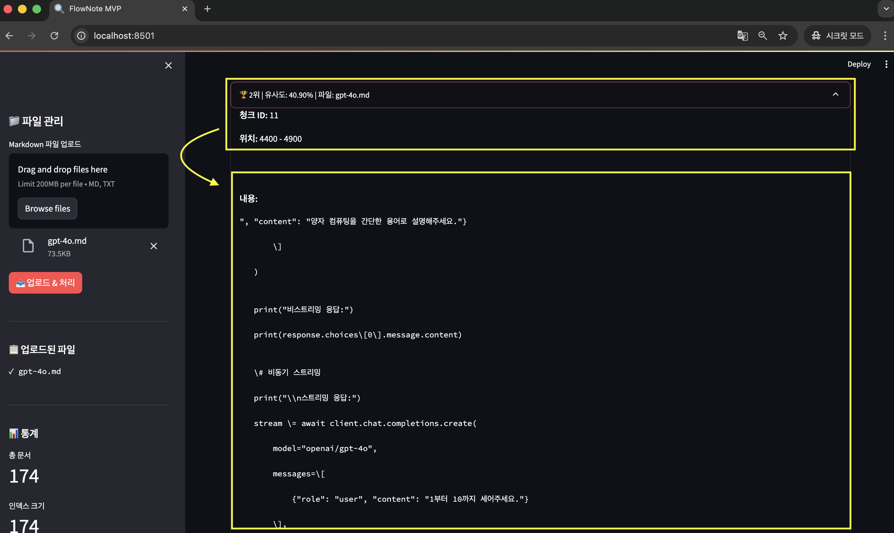

  - `상위 = 3`
  - 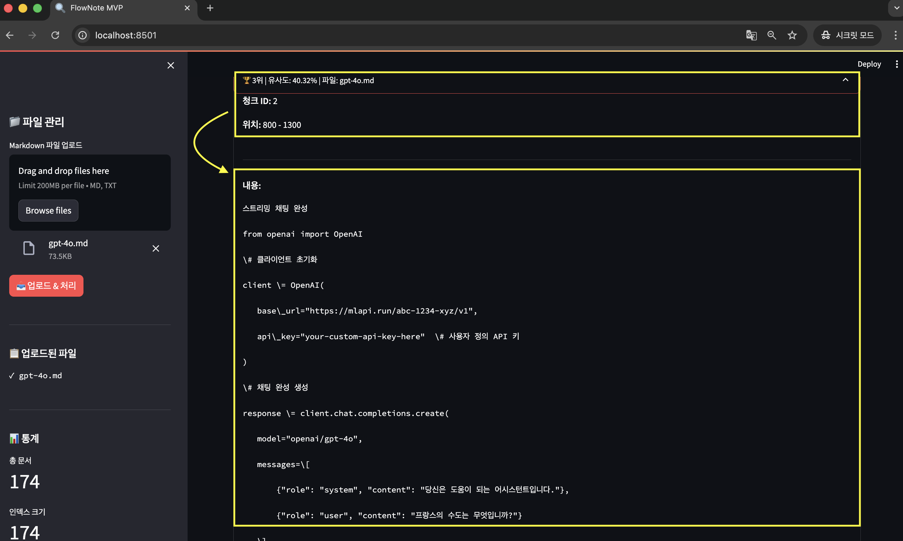

<br>

### ✅ 5) 초기 안내 화면 (retriever 없음)

- 파일 업로드 전 상태에서는 사용 안내 표시

- 세 가지 기능(`업로드`, `검색`, `로컬 저장`) 카드 형태로 시각화

- 테스트 결과:
  - UI 정상 렌더링
  - 각 섹션 설명 정확하게 표시

<br>

## 🧭 4. Review

| 구분          | 검증 항목                          | 결과            |
|--------------|--------------------------------|---------------|
| **`📦 기능 통합`**  | 파일 `업로드` → `청킹` → `임베딩` → `검색` → `출력`    | ✅ 정상 작동       |
| **`🧠 검색 품질`**  | `FAISS 유사도` 결과 정확도 (약 40~50%)    | ✅ 양호          |
| **`🪶 UI 디자인`** | Wide 레이아웃, Expander, Metric 활용 | ✅ 개선 완료       |
| **`⚙️ 코드 구조`**  | `backend 모듈`과 `app.py` 분리 명확       | ✅ 유지보수 용이     |
| **`🔄 세션 상태`**  | `retriever` / `uploaded_files` 관리  | ✅ 정상 유지       |
| **`💾 데이터 관리`** | `로컬 저장` (임시) / *Cloud 연결 예정*       | *⚙️ 향후 업데이트 예정* |

<br>

## 🎯 5. Summary

| 항목                 | 설명                                              |
|--------------------|-------------------------------------------------|
| **`📂 파일 경로`**     | `/flownote-mvp/app.py`                          |
| **`🧠 기능 요약`**     | `Streamlit 기반 UI` 완성, `업로드-청킹-임베딩-검색` 전체 파이프라인 구현   |
| **`🧪 테스트 파일`**    | `test_chunking_embedding.py`, `test_faiss.py`       |
| **`📊 테스트 결과`**    | 청킹 4개 청크 / 임베딩 367토큰 / FAISS 유사도 40.65%         |
| **`💰 토큰 비용`**     | $0.000007                                       |
| **`🧩 주요 패키지`**    | `streamlit`, `faiss-cpu`, `langchain`, `openai`, `dotenv` |
| **`🎉 MVP 완성 여부`** | **`✅ 전체 파이프라인 완성`** / **`정상 작동`** 확인                        |

<br>

## 🪄 6. 실행 가이드

```bash
    # 가상환경 활성화
    pyenv activate myenv

    # Streamlit 실행
    streamlit run app.py

    # 브라우저 자동 실행
    # http://localhost:8501

```

<br>

## 📌 7. Review

### 1) 비고

- 현재 MVP는 로컬 기반 동작 (파일, 인덱스, 임시 저장)

- 차후 버전(v1.1)에서 클라우드 연동 및 사용자 계정 기반 검색 기록 기능 추가 예정

<br>

### 2) 📄 요약

- 🎨 Streamlit UI 완전 업데이트
- 🧪 테스트: 청킹·임베딩·FAISS 통합 성공
- 📦 패키지 종속성 업데이트
- 🎊 MVP 기능 완성 및 전체 파이프라인 검증 완료
